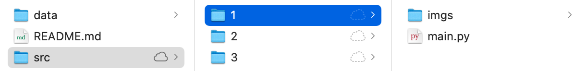
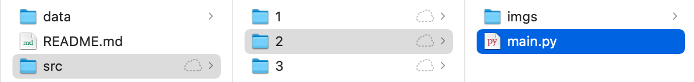
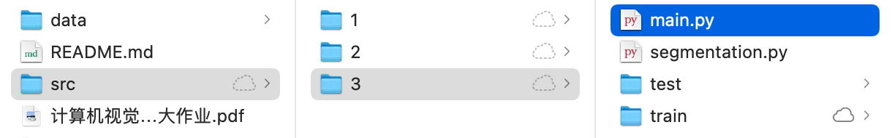
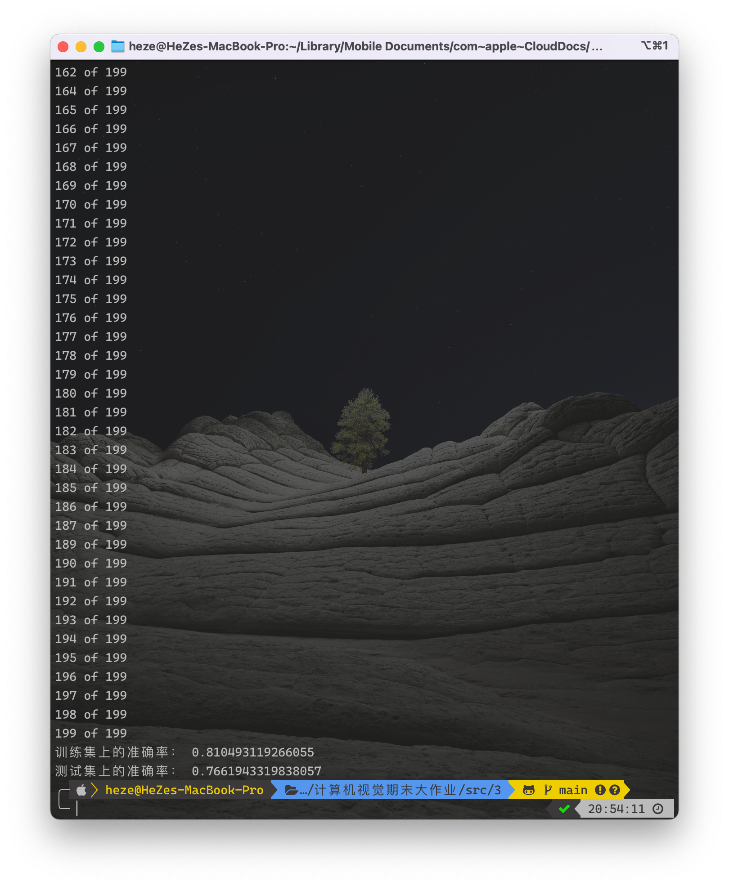

<h1 align=center>计算机视觉  期末大作业</h1>

<h1 align=center>18340052  何泽</h1>

## Ⅰ

> 结合 “Lecture 6 Resizing“ 的 Seam Carving 算法，设计并实现前景保持的图像缩放，前景由 gt 文件夹中对应的标注给定。要求使用“Forward Seam Removing”机制，X，Y 方向均要进行压缩。压缩比例视图像内容自行决定(接近 1-前景区域面积/(2*图像面积)即可)。每一位同学从各自的测试子集中任选两张代表图，将每一步的 seam removing 的删除过程记录，做成 gif 动画格式提交， 测试子集的其余图像展示压缩后的图像结果。

### 1. 算法原理

首先，给定$n\times m$ 的图像$I$，能量函数有如下定义：
$$
E(I)=\left|\frac{\partial}{\partial x} I\right|+\left|\frac{\partial}{\partial y} I\right|
$$
某一像素点的能量越大，则它也越重要，seam线就是由图像中那些不重要的像素点组成的。

对于上述n x m 的图像I， 一个竖直的seam线定义如下：
$$
s^{x}=\left\{s_{i}^{x}\right\}_{i=1}^{n}=\{(x(i), i)\}_{i=1}^{n}, \text { 其中 } \forall \mathrm{i}, \mathrm{I} x(i)-x(\mathrm{i}-1) \mathrm{l} \leq 1
$$
对于给定的能量函数 $e( I )$，有seam线的代价函数定义：
$$
E(s)=E\left(I_{s}\right)=\sum_{i=1}^{n} e\left(I\left(s_{i}\right)\right)
$$
当前要选择的seam线即为代价函数值最小的缝合线。设当前状态下最优的缝合线为 $\mathrm{S}^{\star}$ :
$$
s^{*}=\min _{s} E(s)=\min _{s} \sum_{i=1}^{n} e\left(I\left(s_{i}\right)\right)
$$
接下来可以利用动态规划来求解寻找最低代价的seam线：
$$
M(i, j)=\min \left\{\begin{array}{l}
M(i-1, j-1)+|I(i, j+1)-I(i, j-1)|+|I(i-1, j)-I(i, j-1)| \\
M(i-1, j)+|I(i, j+1)-I(i, j-1)| \\
M(i-1, j+1)+|I(i, j+1)-I(i, j-1)|+|I(i-1, j)-I(i, j+1)|
\end{array}\right.
$$

### 2. 代码实现

> 注：由于计算能量图、寻找并移除最小seam线我都是分水平和垂直方向分别写的，而这两个方向的代码差别不大，为了节省篇幅避免重复下面都是以水平方向举例

- 计算梯度能量

    ```python
    def energy(img):
        gaussian_blur = cv2.GaussianBlur(img, (3, 3), 0, 0)
        gray = cv2.cvtColor(gaussian_blur, cv2.COLOR_BGR2GRAY)
        x = cv2.Sobel(gray,cv2.CV_64F,1,0,ksize=3,scale=1,delta=0,borderType=cv2.BORDER_DEFAULT,)
        y = cv2.Sobel(gray,cv2.CV_64F,0,1,ksize=3,scale=1,delta=0,borderType=cv2.BORDER_DEFAULT,)
        return cv2.add(np.absolute(x), np.absolute(y))
    ```

- 计算水平方向能量图，如果在前景图中为前景则赋值1e6以确保保持前景

    ```python
    def cal_energy_horizon(energy,img_gt):
        (height, width) = energy.shape[:2]
        energy_map = np.zeros((height, width))
        for j in range(1, width):
            for i in range(height):
                top = (energy_map[i - 1, j - 1] if i - 1 >= 0 else 1e6)
                middle = energy_map[i, j - 1]
                bottom = (energy_map[i + 1, j - 1] if i + 1 < height else 1e6)
                energy_map[i, j] = energy[i, j] + min(top, middle, bottom)
        for i in range(1, height):
            for j in range(width):
                if img_gt[i, j, 0] > 128:
                    energy_map[i,j] = 1e6
        return energy_map
    ```

- 寻找水平方向最小seam线

    ```python
    def findseam_horizon(img,energy_map):
        height, width = energy_map.shape[0], energy_map.shape[1]
        before, seam = 0, []
        for i in range(width - 1, -1, -1):
            col = energy_map[:, i]
            if i == width - 1:
                before = np.argmin(col)
            else:
                top = (col[before - 1] if before - 1 >= 0 else 1e6)
                middle = col[before]
                bottom = (col[before + 1] if before + 1 < height else 1e6)
                before += np.argmin([top, middle, bottom]) - 1
            seam.append([i, before])
        return seam
    ```

- 移除水平方向最小seam线

    ```python
    def removeseam_horizon(img, seam):
        (height, width, depth) = img.shape
        removed = np.zeros((height - 1, width, depth), np.uint8)
        for (x, y) in reversed(seam):
            removed[0:y, x] = img[0:y, x]
            removed[y:height - 1, x] = img[y + 1:height, x]
        return removed
    ```

- 实时显示删除过程并将这一帧存入list方便之后生成GIF

    ```python
    def plot(img, seam,image_list):
        cv2.polylines(img, np.int32([np.asarray(seam)]), False, (0, 255, 0))
        image_list.append(img)
        cv2.imshow('seam', img)
        cv2.waitKey(1)
    ```

- 主函数，含义都在注释里

    ```python
    #读取哪张图片在下面更改即可
    img_number="52"
    # 读取相应编号原图和前景图
    img = cv2.imread("../../data/imgs/"+img_number+".png")
    img_gt = cv2.imread("../../data/gt/"+img_number+".png")
    # 原图像长宽
    img_height, img_width = img.shape[0], img.shape[1]
    # 缩放比例
    ratio = 0.5
    # 缩放后的长宽
    width = int(ratio * img_width)
    height = int(img_height * ratio)
    
    cv2.namedWindow('seam', cv2.WINDOW_NORMAL)
    # 先在当前目录生成原图和前景图
    cv2.imwrite(img_number+"_origin.png", img)
    cv2.imwrite(img_number+"_gt.png", img_gt)
    # 计算在水平方向和垂直方向各需要删除多少像素
    x = img_width - width if img_width > width else 0
    y = img_height - height if img_height > height else 0
    
    # 用于存放生成GIF的各帧图片
    image_list=[]
    # 水平方向
    for i in range(y):
        energy_map = cal_energy_horizon(energy(img),img_gt)
        seam = findseam_horizon(img,energy_map)
        plot(img, seam,image_list)
        img = removeseam_horizon(img, seam)
    # 垂直方向
    for i in range(x):
        energy_map = cal_energy_vertical(energy(img),img_gt)
        seam = findseam_vertical(img,energy_map)
        plot(img, seam,image_list)
        img = removeseam_vertical(img, seam)
    
    # 生成结果图
    cv2.imwrite(img_number+'_result.png', img)
    cv2.imshow('seam', img)
    # 生成GIF
    imageio.mimsave(img_number+'.gif', image_list, 'GIF', duration=0.1)
    cv2.waitKey(0)
    cv2.destroyAllWindows()
    ```

### 3. 运行说明

data文件夹需与src在同一目录，即文件目录要如下所示便可直接运行，之后运行`main.py`即可



### 4. 结果展示

<table frame="void" border=0 > 
    <tr>
        <td><p align=center>原图</p></td> 
        <td><p align=center>前景图</p></td> 
        <td><p align=center>结果图（缩放比例为0.5左右）</p></td> 
    </tr>
    <tr>
        <td></td> 
        <td></td> 
        <td></td> 
    </tr>
    <tr>
        <td></td> 
        <td></td> 
        <td></td> 
    </tr>
    <tr>
        <td></td> 
        <td></td> 
        <td></td> 
    </tr>
    <tr>
        <td></td> 
        <td></td> 
        <td></td> 
    </tr>
    <tr>
        <td></td> 
        <td></td> 
        <td></td> 
    </tr>
    <tr>
        <td></td> 
        <td></td> 
        <td></td> 
    </tr>
    <tr>
        <td></td> 
        <td></td> 
        <td></td> 
    </tr>
</table>

### 5. 结果分析

通过以上对比可以发现较好地进行了缩放，对于一些前景较宽的图片（甚至有的前景占据了整个宽度如上图倒数第二排）由于放大比例较大无法保证前景全部保留但是仍保留了绝大部分，只删掉了一小部分边缘。

## Ⅱ

> 结合“Lecture 7 Segmentation”内容及参考文献[1]，实现基于 Graph- based image segmentation方法(可以参考开源代码，建议自己实现)，通过设定恰当的阈值将每张图分割为 50~70 个区域，同时修改算法要求任一分割区域 的像素个数不能少于 50 个(即面积太小的区域需与周围相近区域合并)。结合 GT 中给定的前景 mask，将每一个分割区域标记为前景(区域 50%以上的像素 在 GT 中标为 255)或背景(50%以上的像素被标为 0)。区域标记的意思为将该 区域内所有像素置为 0 或 255。要求对测试图像子集生成相应处理图像的前景标注并计算生成的前景 mask 和 GT 前景 mask 的 IOU 比例。假设生成的前景区域为 R1，该图像的 GT 前景区域为 R2，则$IOU=\frac{R1\cap R2}{R1\cup R2}$

### 1. 算法流程

- 计算每个像素点的不相似度，使用像素点间的RGB距离
    $$
    s=\sqrt{(r_i-r_j)^2+(g_i-g_j)^2+(b_i-b_j)^2}
    $$

- 将边按照不相似度排序得到边集$E=\{e1,e2,…,en\}$

- 进行合并，当区域间的差异值大于最小区域内差异值时，不能将两个区域合并，否则两个区域就可以合并，更新新区域，一直重复这个操作

- 找不到一条边能够满足条件则结束

- 结束后，会得到一个区域集合含有若干个点集，此时图像就被分成了若干个区域

### 2. 代码实现

- 定义一个类表示每个区域，包含寻找根节点和合并两个节点这两个方法

    ```python
    class area:
        def __init__(self, num_node):
            self.parent = [i for i in range(num_node)]
            self.size = [1 for _ in range(num_node)]
            self.num_set = num_node
    
        # 寻找根节点
        def find(self, u):
            if self.parent[u] == u:
                return u
            self.parent[u] = self.find(self.parent[u])
            return self.parent[u]
    
        # 合并两个节点
        def merge(self, u, v):
            u = self.find(u)
            v = self.find(v)  
            # 若两个父节点不同
            if u != v:
                # 子节点多的当父节点
                if self.size[u] > self.size[v]:
                    self.parent[v] = u
                    self.size[u] += self.size[v]
                    # 被合并的根节点的子节点数目变为1
                    self.size[v] = 1  
                else:
                    self.parent[u] = v 
                    self.size[v] += self.size[u]
                    self.size[u] = 1 
                self.num_set -= 1
    ```

- 计算RGB距离并创建图的边

    ```python
    def create_edge(img, width, x1, y1, x2, y2):
        # 计算RGB距离
        r = math.pow((img[0][y1, x1] - img[0][y2, x2]), 2)
        g = math.pow((img[1][y1, x1] - img[1][y2, x2]), 2)
        b = math.pow((img[2][y1, x1] - img[2][y2, x2]), 2)
        return (y1 * width + x1, y2 * width + x2, math.sqrt(r + g + b))
    ```

- 建立图结构

    ```python
    def build_graph(img, width, height):
        graph = []
        for y in range(height):
            for x in range(width):
                if x < width - 1:
                    graph.append(create_edge(img, width, x, y, x + 1, y))
                if y < height - 1:
                    graph.append(create_edge(img, width, x, y, x, y + 1))
                if x < width - 1 and y < height - 1:
                    graph.append(create_edge(img, width, x, y, x + 1, y + 1))
                if x < width - 1 and y > 0:
                    graph.append(create_edge(img, width, x, y, x + 1, y - 1))
        return graph
    ```

- 分割

    ```python
    def segment_graph(sorted_graph, num_node, k):
        res = area(num_node)
        # 类内不相似度
        threshold = [k] * num_node
        for edge in sorted_graph:
            u = res.find(edge[0])
            v = res.find(edge[1])
            w = edge[2]
            # 如果两个节点的父节点不相同则不属于同一类
            if u != v:  
                # 如果边的权重小于阈值
                if w <= threshold[u] and w <= threshold[v]:
                    # 合并两个节点
                    res.merge(u, v)  
                    parent = res.find(u)
                    # 更新最大类内间距
                    threshold[parent] = np.max([w, threshold[u], threshold[v]]) + k / res.size[parent]
        return res
    ```

- 移除面积过小的区域

    ```python
    def remove_small_component(res, sorted_graph, min_size):
        for edge in sorted_graph:
            u = res.find(edge[0])
            v = res.find(edge[1])
            if u != v:
                if res.size[u] < min_size or res.size[v] < min_size:
                    res.merge(u, v)
        print('划分的区域个数为', res.num_set)
        return res
    ```

- 生成结果图

    ```python
    def generate_image(res, width, height, area):
        # 随机生成颜色
        color = [(int(random.random() * 255), int(random.random() * 255),int(random.random() * 255)) for i in range(width * height)]
        save_img = np.zeros((height, width, 3), np.uint8)
        for y in range(height):
            for x in range(width):
                color_idx = res.find(y * width + x)
                area.append(color_idx)
                save_img[y, x] = color[color_idx]
        return save_img
    ```

- 生成区域标记后的图片并计算IOU

    ```python
    def cal_IOU(img_gt, res, width, height, area):
        save_img = np.zeros((height, width, 3), np.uint8)
        # 划分出的所有区域
        area = list(set(area))
        # 每个区域遍历
        for i in range(len(area)):
            # 这个区域的面积
            total_area = 0
            # 在前景图中是前景的面积
            gt_area = 0
            # 寻找这个区域中是前景的点
            for y in range(height):
                for x in range(width):
                    if(res.find(y * width + x) == area[i]):
                        if(img_gt[y, x, 0] > 128):
                            gt_area += 1
                        total_area += 1
            # 如果前景占比大于一半则在标记图中标为全白
            if(float(gt_area/total_area) > 0.5):
                for y in range(height):
                    for x in range(width):
                        if(res.find(y * width + x) == area[i]):
                            save_img[y, x] = (255, 255, 255)
            # 否则不是前景则全黑
            else:
                for y in range(height):
                    for x in range(width):
                        if(res.find(y * width + x) == area[i]):
                            save_img[y, x] = (0, 0, 0)
        # 计算IOU
        IOU = 0.0
        R1_and_R2 = 0
        R1_or_R2 = 0
        for y in range(height):
            for x in range(width):
                if(save_img[y, x, 0] > 128 and img_gt[y, x, 0] > 128):
                    R1_and_R2 += 1
                if(save_img[y, x, 0] > 128 or img_gt[y, x, 0] > 128):
                    R1_or_R2 += 1
        IOU = (float)(R1_and_R2/R1_or_R2)
        return IOU, save_img
    ```

- 主函数，含义都在注释中

    ```python
    # 读取哪张图片在下面更改即可
    img_number = "52"
    # 读取相应编号原图和前景图
    img = cv2.imread("../../data/imgs/"+img_number+".png")
    img_gt = cv2.imread("../../data/gt/"+img_number+".png")
    # 先在当前目录生成原图和前景图
    cv2.imwrite(img_number+"_origin.png", img)
    cv2.imwrite(img_number+"_gt.png", img_gt)
    img = cv2.cvtColor(img, cv2.COLOR_BGR2RGB)
    height, width, channel = img.shape
    img = np.asarray(img, dtype=float)
    img = cv2.split(img)
    # 建立图结构
    graph = build_graph(img, width, height)
    # 按照权重进行不减的排序
    def weight(edge): return edge[2]
    # 根据权重对所有的边进行排序
    sorted_graph = sorted(graph, key=weight)
    # 每个区域最小面积
    min_size = 50
    # 分割
    res = segment_graph(sorted_graph, width * height, 1)
    res = remove_small_component(res, sorted_graph, min_size)
    # 生成结果图
    area = []
    img = generate_image(res, width, height, area)
    IOU, img2 = cal_IOU(img_gt, res, width, height, area)
    print(f"IOU的值为{IOU}")
    # 将IOU的值写到区域标记图的左上角
    cv2.putText(img2, "IOU=%.4f" % IOU, (5, 15), cv2.FONT_HERSHEY_SIMPLEX, 0.5, (255, 255, 255), 2)
    # 显示图片
    cv2.imshow('result', img)
    cv2.imshow('区域标记', img2)
    # 按序号保存图片
    cv2.imwrite(img_number+'_result.png', img)
    cv2.imwrite(img_number+'_mark.png', img2)
    cv2.waitKey(0)
    cv2.destroyAllWindows()
    ```

### 3. 运行说明

data文件夹需与src在同一目录，即文件目录要如下所示便可直接运行，之后运行`main.py`即可



### 4. 结果展示

（我在得到结果图之后也将区域标记的结果图保存了下来并在图片上一起显示了IOU的数值）

<table frame="void" border=0 > 
    <tr>
        <td><p align=center>原图</p></td> 
        <td><p align=center>前景图</p></td> 
        <td><p align=center>区域标记后的图片</p></td> 
        <td><p align=center>结果图</p></td> 
    </tr>
    <tr>
        <td></td> 
        <td></td> 
        <td></td> 
        <td></td> 
    </tr>
    <tr>
        <td></td> 
        <td></td> 
        <td></td> 
        <td></td> 
    </tr>
    <tr>
        <td></td> 
        <td></td> 
        <td></td> 
        <td></td> 
    </tr>
    <tr>
        <td></td> 
        <td></td> 
        <td></td> 
        <td></td> 
    </tr>
    <tr>
        <td></td> 
        <td></td> 
        <td></td> 
        <td></td> 
    </tr>
    <tr>
        <td></td> 
        <td></td> 
        <td></td> 
        <td></td> 
    </tr>
    <tr>
        <td></td> 
        <td></td> 
        <td></td> 
        <td></td> 
    </tr>
    <tr>
        <td></td> 
        <td></td> 
        <td></td> 
        <td></td> 
    </tr>
    <tr>
        <td></td> 
        <td></td> 
        <td></td> 
        <td></td> 
    </tr>
    <tr>
        <td></td> 
        <td></td> 
        <td></td> 
        <td></td> 
    </tr>
</table>

### 5. 结果分析

以上的图片每一张我都是根据划分出的区域数量手动调整k的值使区域数量在50-70之间，可以看到基本上都有着不错的划分，算法实现是正确的；同时生成区域标记的图片之后可以看到IOU在71%到97%之间，也是在一个较高的范围中，实验结果还是较为理想的。

## Ⅲ

> 从训练集中随机选择 200 张图用以训练，对每一张图提取归一化 RGB 颜色直方图(8x8x8=512 维)，同时执行问题 2 对其进行图像分割，(分割为 50~70 个区域)，对得到的每一个分割区域提取归一化 RGB 颜色直方图特征(维度为 8x8x8=512)，将每一个区域的颜色对比度特征定义为区域颜色直方图和全图颜色直方图的拼接，因此区域颜色区域对比度特征的维度为 2*512=1024 维，采用 PCA 算法对特征进行降维取前 20 维。利用选择的 200 张图的所有区域(每个区域20 维特征)构建 visual bag of words dictionary (参考 Lecture 12. Visual Bag of Words 内容)，单词数(聚类数)设置为 50 个，visual word 的特征设置为聚簇样本的平均特征，每个区域降维后颜色对比度特征(20 维)和各个 visual word 的特征算点积相似性得到 50 个相似性值形成 50 维。将得到的 50 维特征和前面 的 20 维颜色对比度特征拼接得到每个区域的 70 维特征表示。根据问题 2，每个区域可以被标注为类别 1(前景:该区域 50%以上像素为前景)或 0(背景:该区域 50%以上像素为背景)，选用任意分类算法(SVM，Softmax，随机森林，KNN 等)进行学习得到分类模型。最后在测试集上对每一张图的每个区域进行测试(将图像分割为50~70个区域，对每个区域提取同样特征并分类)，根据测试图像的GT，分析测试集区域预测的准确率。

### 1. 算法流程

- 提取归一化 RGB 颜色直方图特征并将区域颜色直方图和全图颜色直方图的拼接
- 采用PCA降维
- 构建 visual bag of words dictionary，将得到的 50 维特征和前面 的 20 维颜色对比度特征拼接得到每个区域的 70 维特征表示
- 使用随机森林对数据集分类

### 2. 代码实现

首先，我运行上个任务的代码对200张图片（编号为4，8，12，...，796）进行区域划分作为训练集，再将上一题处理过的图片作为测试集，两个文件夹分别命名train和test放到和代码同一目录下。

- 提取归一化RGB颜色直方图

    ```python
    def cal_hist(img, bin, mask=None):
        # 若没有遮罩，则将图像变为(height*width,3)的一列像素
        if mask is None:
            height, width, _ = img.shape
            img = np.reshape(img, newshape=(height*width, 3))
        else:
            # 拉伸
            assert img.shape[:2] == mask.shape
            front_size = len(mask[mask == 255])
            ret = np.zeros(shape=(front_size, 3), dtype=np.uint8)
            height, width, _ = img.shape
            i = 0
            for r in range(height):
                for c in range(width):
                    if mask[r, c] == 255:
                        ret[i] = img[r, c]
                        i += 1
            img = ret
        length, channel = img.shape
        assert channel == 3
        interval = 256 / bin
        colorspace = np.zeros(shape=(bin, bin, bin), dtype=float)
        for p in range(length):
            v = img[p, :]
            i, j, k = math.floor(v[0]/interval), math.floor(v[1]/interval), math.floor(v[2]/interval)
            colorspace[i, j, k] += 1
        res = np.reshape(colorspace, newshape=int(math.pow(bin, 3)))
        res = res / length
        return res
    ```

- 计算特征矩阵

    ```python
    def cal_fmat(img, bin, res, t):
        # 提取归一化RGB颜色直方图
        img_fvec = cal_hist(img, bin)
        m = []
        # 图像分割后的每一个区域
        for comp in res.all_area():
            mask = np.zeros(shape=(t.height, t.width), dtype=np.uint8)
            v = res.one_area(comp)
            for i in v:
                pix = t.t[i]
                mask[pix[0], pix[1]] = 255
            comp_fvec = cal_hist(img, bin, mask)
            # 拼接颜色直方图和全图颜色直方图
            fvec = np.concatenate((comp_fvec, img_fvec))
            m.append(fvec)
        m = np.array(m)
        return m
    ```

- 调用上面的函数在200张图片上提取特征

    ```python
    x_train, y_train = [], []
    x_test, y_test = [], []
    # 提取特征
    for i in range(1, 200):
        img_number = str(i*4)
        # 排除末尾是学号的
        if((i*4) % 100 != 52):
            # 打印进度
            print(str(i)+" of 199")
            # 读取相应编号训练原图和前景图
            img = cv2.imread("train/img/"+img_number+"_origin.png")
            img_mark = cv2.imread("train/mark/"+img_number+"_mark.png")
            img_mark = cv2.cvtColor(img_mark, cv2.COLOR_BGR2GRAY)
            # 调用之前写的图像分割
            res = segment(img)
            t = position(img.shape[0], img.shape[1])
            # 计算特征矩阵
            fmat = cal_fmat(img, 8, res, t)
            for fvec in fmat:
                x_train.append(fvec)
            y_train = y_train + cal_ytrain(t, res.all_area(), img_mark)
    	# 末尾是学号
        else:
            # # 读取相应编号测试原图和前景图进行相同操作
            img = cv2.imread("test/img/"+img_number+"_origin.png")
            img_mark = cv2.imread("test/mark/"+img_number+"_mark.png")
            img_mark = cv2.cvtColor(img_mark, cv2.COLOR_BGR2GRAY)
            res = segment(img)
            t = position(img.shape[0], img.shape[1])
            fmat = cal_fmat(img, 8, res, t)
            for fvec in fmat:
                x_test.append(fvec)
            y_test = y_test + cal_ytrain(t, res.all_area(), img_mark)
    ```

- PCA降维并构建visual bag of words dictionary

    ```python
    # PCA降维
    x_train = PCA(n_components=20).fit_transform(x_train)
    # 构建 visual bag of words dictionary
    bow_trainer1 = cv2.BOWKMeansTrainer(50)
    bow_trainer1.add(np.float32(x_train))
    v1 = bow_trainer1.cluster()
    x_train = np.hstack((x_train, np.dot(x_train, v1.T)))
    x_train, y_train = np.array(x_train), np.array(y_train)
    ```

- 随机森林，限制最大深度5，并测试准确率

    ```python
    rfc = RandomForestClassifier(max_depth=5)
    rfc.fit(x_train, y_train)
    y_train_predict = rfc.predict(x_train)
    y_test_predict = rfc.predict(x_test)
    print("训练集上的准确率：", accuracy_score(y_train, y_train_predict))
    print("测试集上的准确率：", accuracy_score(y_test, y_test_predict))
    ```

### 3. 运行说明

data文件夹需与src在同一目录，测试集和训练集的文件夹要和代码在同一目录，即文件目录要如下所示便可直接运行，之后运行`main.py`即可



### 4. 运行结果与分析



可以看到在训练集上准确率为81.05%，测试集上为76.62%，这个准确率是较高的。

